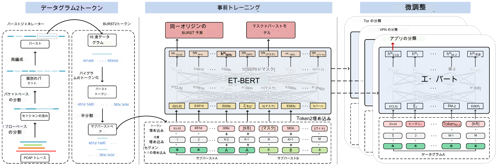

# ET-BERT

[](https://codebeat.co/projects/github-com-linwhitehat-et-bert-main)

[](https://arxiv.org/abs/2202.06335)


**暗号化されたトラフィックのネットワーク トラフィック分類モデルである ET-BERT のリポジトリ。**

ET-BERT は、暗号化されたトラフィックからデータグラムのコンテキスト関係を学習する方法であり、**さまざまな暗号化トラフィック シナリオに直接適用して、トラフィックのクラスを正確に識別する**ことができます。まず、ET-BERT は大規模なラベルのないトラフィックでマルチレイヤー アテンションを使用して、データグラム間のコンテキストとトラフィック間のトランスポート関係の両方を学習します。次に、ET-BERT を特定のシナリオに適用して、ラベル付きの暗号化されたトラフィックを小規模に微調整することで、トラフィックの種類を識別できます。


*[第31回 The Web Conference](https://www2022.thewebconf.org/)*で作品が紹介されました。
> Xinjie Lin、Gang Xiong、Gaopeng Gou、Zhen Li、Junzheng Shi、Jing Yu。 2022. ET-BERT: 暗号化されたトラフィック分類のための事前トレーニング トランスフォーマーによるコンテキスト化されたデータグラム表現。 Web Conference (WWW) 2022、フランス、リヨンの議事録。コンピューティング機械協会。

注: このコードは [UER-py](https://github.com/dbiir/UER-py) に基づいています。著者に感謝します。
<br/>

目次
=================
  * [Requirements](#requirements)
  * [Datasets](#datasets)
  * [Using ET-BERT](#using-et-bert)
  * [Reproduce ET-BERT](#reproduce-et-bert)
  * [Citation](#citation)
  * [Contact](#contact)
<br/>

## Requirements(実験要件)
* Python >= 3.6
* CUDA: 11.4
* GPU: Tesla V100S
* torch >= 1.1
* six >= 1.12.0
* scapy == 2.4.4
* numpy == 1.19.2
* shutil, random, json, pickle, binascii, flowcontainer
* argparse
* packaging
* tshark
* [SplitCap](https://www.netresec.com/?page=SplitCap)
* [scikit-learn](https://scikit-learn.org/stable/)
*混合精度トレーニングには、NVIDIA の apex が必要です
*事前トレーニング済みのモデル変換 (TensorFlow に関連) には、TensorFlow が必要です。
※wordpieceモデルでのトークン化には【WordPiece】(https://github.com/huggingface/tokenizers)が必要です。
*シークエンス ラベリング ダウンストリーム タスクで CRF を使用するには、[pytorch-crf](https://github.com/kmkurn/pytorch-crf) が必要です。

**また、必要なpythonライブラリはrequirements.txtに纏めてある為、以下のコマンドで一括インストールが可能です。**
```
pip install -r requirements.txt
```
<br/>


## datasets(データセット)
実際の TLS 1.3 データセットは、中国科学技術ネットワーク (CSTNET) で 2021 年 3 月から 7 月まで収集されます。プライバシーを考慮して、匿名データのみを公開します ([CSTNET-TLS 1.3](CSTNET-TLS%201.3/readme.md) を参照)。

比較実験に使用した他のデータセットは公開されています。詳細については、[論文](https://arxiv.org/abs/2202.06335) を参照してください。独自のデータを使用する場合は、データ形式が「datasets/cstnet-tls1.3/」と同じであることを確認し、「data_process/」でデータ パスを指定してください。

<br/>

## Using ET-BERT(ET-BERTを使用する)
事前トレーニング済みの ET-BERT を直接使用できるようになりました [model](https://drive.google.com/file/d/1r1yE34dU2W8zSqx1FkB8gCWri4DQWVtE/view?usp=sharing) or download via:
```
wget -O pretrained_model.bin https://drive.google.com/file/d/1r1yE34dU2W8zSqx1FkB8gCWri4DQWVtE/view?usp=sharing
```

事前トレーニング済みのモデルを取得した後、ラベル付けされたネットワーク トラフィックを使用してパケット レベルで微調整することにより、ET-BERT をスペティック タスクに適用できます。
```
python3 fine-tuning/run_classifier.py --pretrained_model_path models/pre-trained_model.bin \
                                   --vocab_path models/encryptd_vocab.txt \
                                   --train_path datasets/cstnet-tls1.3/packet/train_dataset.tsv \
                                   --dev_path datasets/cstnet-tls1.3/packet/valid_dataset.tsv \
                                   --test_path datasets/cstnet-tls1.3/packet/test_dataset.tsv \
                                   --epochs_num 10 --batch_size 32 --embedding word_pos_seg \
                                   --encoder transformer --mask fully_visible \
                                   --seq_length 128 --learning_rate 2e-5
```

微調整された分類子モデルのデフォルト パスは、`models/finetuned_model.bin` です。次に、微調整されたモデルで推論を行うことができます。
```
python3 inference/run_classifier_infer.py --load_model_path models/finetuned_model.bin \
                                          --vocab_path models/encryptd_vocab.txt \
                                          --test_path datasets/cstnet-tls1.3/packet/nolabel_test_dataset.tsv \
                                          --prediction_path datasets/cstnet-tls1.3/packet/prediction.tsv \
                                          --labels_num 120 \
                                          --embedding word_pos_seg --encoder transformer --mask fully_visible
```
<br/>

## Reproduce ET-BERT(ET-BERTを再現する)
### Pre-process(事前処理)
ネットワーク トラフィック データで ET-BERT を事前トレーニングするために必要な手順を再現するには、次の手順に従います。
 1. `vocab_process/main.py` を実行して、暗号化されたトラフィック コーパスを生成するか、生成されたコーパスを `corpora/` で直接使用します。ファイル パスを変更し、ファイルの先頭にあるいくつかの設定を変更する必要があることに注意してください。
 2. `main/preprocess.py` を実行して、暗号化されたトラフィック バースト コーパスを前処理します。
 **Linuxでは以下のコマンドを実行**
```
python3 preprocess.py --corpus_path corpora/encrypted_traffic_burst.txt \
                      --vocab_path models/encryptd_vocab.txt \
                     --dataset_path dataset.pt --processes_num 8 --target bert
```  

 **Windowsでは以下のコマンドを実行**
```
python3 preprocess.py --corpus_path corpora/encrypted_traffic_burst.txt --vocab_path models/encryptd_vocab.txt --dataset_path dataset.pt --processes_num 8 --target bert
```

3. 処理が必要な pcap 形式のデータセットがある場合は、`data_process/main.py` を実行してダウンストリーム タスク用のデータを生成します。このプロセスには 2 つのステップが含まれます。 1 つ目は、「datasets/main.py:54」で「splitcap=True」を設定して pcap ファイルを分割し、「npy」データセットとして保存することです。次に、微調整データの生成です。共有データセットを使用する場合は、「dataset_save_path」の下に「dataset」という名前のフォルダーを作成し、ここにデータセットをコピーする必要があります。

### Pre-training(事前トレーニング)
ラベル付きデータで ET-BERT を微調整するために必要な手順を再現するには、「pretrain.py」を実行して事前トレーニングします。
 **Linuxでは以下のコマンドを実行**
```
python3 pre-training/pretrain.py --dataset_path dataset.pt --vocab_path models/encryptd_vocab.txt \
                    --output_model_path models/pre-trained_model.bin \
                    --world_size 8 --gpu_ranks 0 1 2 3 4 5 6 7 \
                    --total_steps 500000 --save_checkpoint_steps 10000 --batch_size 32 \
                    --embedding word_pos_seg --encoder transformer --mask fully_visible --target bert
```

 **Windowsでは以下のコマンドを実行**
```
python3 pre-training/pretrain.py --dataset_path dataset.pt --vocab_path models/encryptd_vocab.txt --output_modelpath models/pre-trained_model.bin --world_size 8 --gpu_ranks 0 1 2 3 4 5 6 7 --total_steps 500000 --save_checkpoint_steps 10000 --batch_size 32 --embedding word_pos_seg --encoder transformer --mask fully_visible --target bert
```
### Fine-tuning on downstream tasks(ダウンストリーム タスクの微調整)
暗号化されたトラフィック分類タスクに ET-BERT を使用する方法の例を確認するには、[Using ET-BERT](#using-et-bert) および `fine-tuning` フォルダの `run_classifier.py` スクリプトに移動します。 

注: プログラムのパスを変更する必要があります。
<br/>

## Citation
#### If you are using the work (e.g. pre-trained model) in ET-BERT for academic work, please cite the [paper](https://arxiv.org/abs/2202.06335) published in WWW 2022:

```
@inproceedings{lin2022bert,
  author    = {Xinjie Lin and
               Gang Xiong and
               Gaopeng Gou and
               Zhen Li and
               Junzheng Shi and
               Jing Yu},
  editor    = {Fr{\'{e}}d{\'{e}}rique Laforest and
               Rapha{\"{e}}l Troncy and
               Elena Simperl and
               Deepak Agarwal and
               Aristides Gionis and
               Ivan Herman and
               Lionel M{\'{e}}dini},
  title     = {{ET-BERT:} {A} Contextualized Datagram Representation with Pre-training
               Transformers for Encrypted Traffic Classification},
  booktitle = {{WWW} '22: The {ACM} Web Conference 2022, Virtual Event, Lyon, France,
               April 25 - 29, 2022},
  pages     = {633--642},
  publisher = {{ACM}},
  year      = {2022},
  url       = {https://doi.org/10.1145/3485447.3512217},
  doi       = {10.1145/3485447.3512217}
}
```
<br/>


## Contact
Please post a Github issue if you have any questions.
